# CodeJudge AI Architecture

Status: Phase 2 system design artifact.

Phase boundary: this document defines architecture, boundaries, data flow, deployment, monitoring, and security. It does not freeze DTOs, schemas, or API contracts. Those are Phase 3 deliverables.

## Executive Summary

CodeJudge AI is a deterministic evaluation platform for source code, reasoning, prompts, and AI responses. The architecture is intentionally split into a user-facing evaluator console, a FastAPI service, deterministic analysis engines, and local-first storage for evaluations, rubrics, datasets, benchmarks, and audit events.

The system never executes submitted code and never calls LLM APIs. Every result is derived from parsers, ASTs, static rules, metrics, rubric weights, and deterministic heuristics. Every result must include score, confidence, evidence, limitations, detected patterns, and rationale.

## Design Goals

- Deterministic: identical input, engine version, rubric version, and configuration produce identical output.
- Explainable: every score traces back to evidence, rules, metrics, and limitations.
- Safe: submitted code is parsed and inspected only, never executed.
- Fast: typical single-artifact analysis completes under 500 ms.
- Local-first: MVP runs through Docker Compose with SQLite and DuckDB.
- Extensible: language analyzers and evaluation engines can be added through stable plugin boundaries.
- Evaluator-grade: UX feels like an internal AI evaluation workbench, not a chatbot or interview runner.

## Non-Goals

- No code execution sandbox.
- No autonomous coding agent.
- No LLM-as-judge.
- No hidden scoring service.
- No browser-based compilation or runtime tests.
- No repository-wide IDE experience in MVP.

## System Context

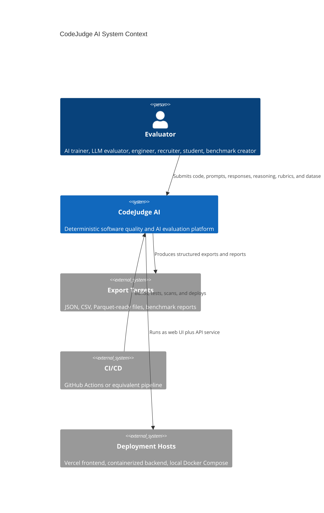

## Container Architecture

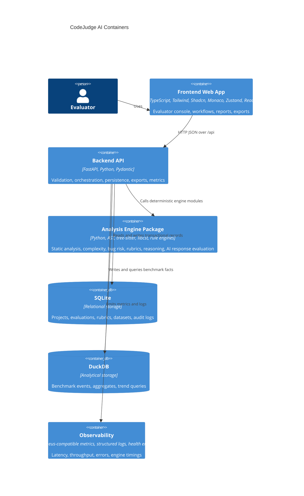

## Component Architecture

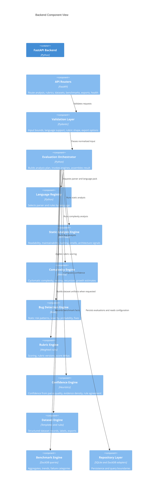

## Frontend Design

The frontend is a Next.js App Router application written in TypeScript. It is the evaluator console and report surface.

### Responsibilities

- Capture inputs for source code, prompts, AI responses, reasoning traces, rubrics, datasets, and solution comparisons.
- Provide a clear workflow around Input -> Analyze -> Score -> Explain -> Improve -> Export.
- Render evidence-first results with score, confidence, limitations, detected patterns, and why.
- Maintain responsive dashboard views for evaluation history, benchmarks, failure categories, confidence distribution, and exports.
- Validate request shape with Zod before sending data to the backend.
- Use React Query for server state and Zustand for local workflow state.
- Use Monaco for code entry and read-only evidence region inspection.
- Provide accessible, keyboard-operable workflows with WCAG AA target.

### Frontend Module Boundaries

- `app`: route-level layouts, metadata, dashboard pages, workflow pages.
- `features/evaluations`: analysis workflow state, forms, result rendering.
- `features/rubrics`: rubric editor, version selector, comparison views.
- `features/datasets`: dataset records, exports, version views.
- `features/benchmarks`: charts, filters, aggregate reports.
- `features/reports`: export previews, shareable report views, print/PDF-friendly layouts.
- `components/ui`: Shadcn primitives and accessible shared UI.
- `components/editor`: Monaco integration, language selector, evidence highlighting.
- `lib/api`: typed HTTP client, React Query hooks.
- `lib/schemas`: Zod schemas mirroring Phase 3 contracts.
- `lib/state`: Zustand stores for active workspace and local preferences.

### UX Architecture

- The first screen is the evaluator dashboard, not a marketing landing page.
- Primary navigation groups the product by evaluator workflows: Code Review, Bug Risk, Complexity, Compare, AI Response, Reasoning, Rubrics, Datasets, Benchmarks, Reports.
- Result screens prioritize evidence and limitations near the score.
- Charts use Recharts with accessible text alternatives and keyboard-visible filter states.
- Mobile layouts collapse into step-based workflows while preserving result readability.

## Backend Design

The backend is a FastAPI service that owns validation, orchestration, persistence, exports, health, and observability.

### Responsibilities

- Validate every request with Pydantic.
- Reject unsupported inputs, oversized payloads, malformed rubrics, and unknown export options.
- Route analysis requests to deterministic engine modules.
- Persist evaluation records, rubric versions, dataset items, benchmark events, and audit logs.
- Return structured, evidence-backed evaluation results.
- Expose health, readiness, metrics, and profiling endpoints.
- Enforce rate limits and security headers.

### Backend Module Boundaries

- `api`: route handlers and dependency wiring.
- `core`: configuration, security headers, rate limiting, logging, metrics.
- `contracts`: Pydantic models defined in Phase 3.
- `orchestration`: evaluation planning and result assembly.
- `analysis`: deterministic engines and shared scoring utilities.
- `languages`: parser adapters and language-specific rule packs.
- `repositories`: SQLite and DuckDB persistence adapters.
- `exports`: JSON, CSV, Parquet-ready export serialization.
- `observability`: metrics, traces, profiler hooks, audit event helpers.
- `tests`: unit, integration, contract, performance, and regression tests.

## Analysis Engine Design

The engine layer is pure, deterministic, and side-effect-light. Engine functions receive normalized input and return structured findings. Persistence, HTTP, UI concerns, and background jobs do not belong inside engine modules.

### Engine Pipeline

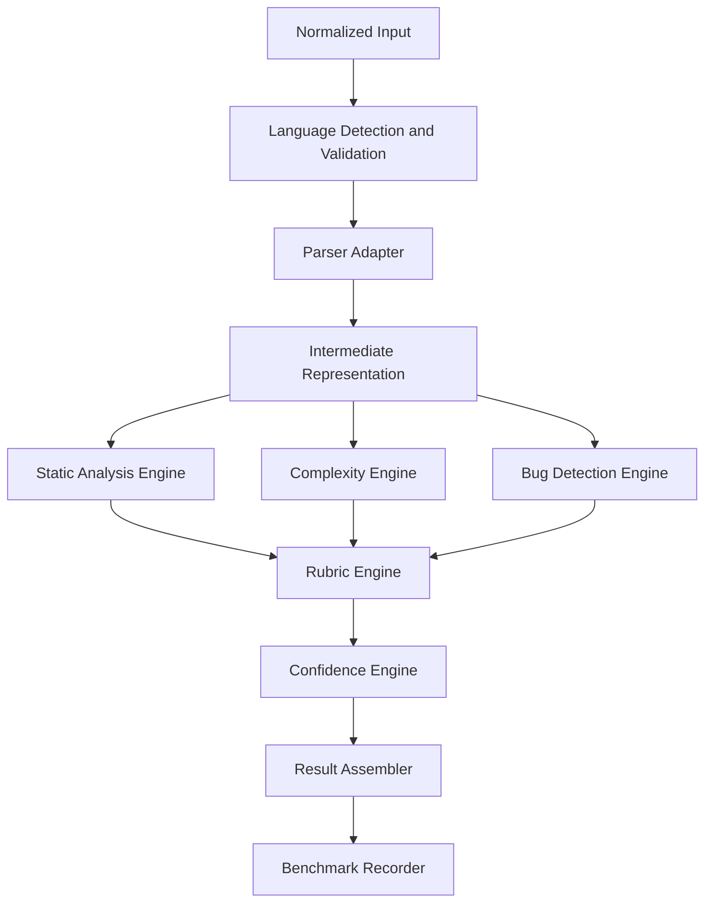

### Static Analysis Engine

Evaluates readability, maintainability, naming, architecture signals, dead code signals, duplication indicators, coupling, cohesion, error handling, and edge coverage indicators.

Inputs:

- Parsed AST or parser tree.
- Token stream.
- Normalized source metadata.
- Language rule pack.
- Optional rubric version.

Outputs:

- Category scores.
- Findings with evidence spans.
- Detected patterns.
- Limitations.
- Rule execution metadata.

### Complexity Engine

Estimates time, space, memory growth, and scalability from structural signals.

Signals:

- Loop nesting.
- Branching.
- Recursion and mutual-recursion indicators.
- Collection allocation and growth.
- Calls inside loops.
- Sorting and search idioms.
- Comprehensions and iterators.
- Input-size variable hints.

The engine reports proof-style rationale and confidence. It does not claim runtime measurement.

### Bug Detection Engine

Detects static risk patterns only when evidence is present.

Risk families:

- Off-by-one and boundary mistakes.
- Null or undefined access.
- Async mistakes.
- Resource leaks.
- Blocking operations.
- Bad recursion.
- Unhandled states.
- Overflow risks.
- Race-condition indicators.

Each finding includes severity, probability, confidence, fix guidance, evidence, and limitations.

### Rubric Engine

Applies weighted scoring to engine outputs and evaluator-defined criteria.

Responsibilities:

- Normalize weights.
- Apply criterion thresholds.
- Produce score breakdowns.
- Preserve rubric version metadata.
- Explain score changes.
- Support comparison between rubric versions.

### Confidence Engine

Confidence is computed from observable signals, not vibes.

Inputs:

- Parse success and parser confidence.
- Evidence count and evidence quality.
- Rule agreement or disagreement.
- Language support tier.
- Source completeness.
- Rubric coverage.
- Known limitations.

Outputs:

- Overall confidence.
- Per-finding confidence.
- Confidence drivers.
- Confidence reducers.

### Dataset Engine

Produces structured dataset records from detected features, rubric definitions, and deterministic templates tied to evidence. It must not invent claims that cannot be traced to inputs or configured templates.

### Benchmark Engine

Stores and aggregates evaluation facts for trends, slices, and reports.

Dimensions:

- Engine version.
- Rubric version.
- Language.
- Input type.
- Evaluation type.
- Failure category.
- Confidence band.
- Score band.
- Timestamp.

## Language Plugin Architecture

Language support is added through language packs.

### Language Pack Responsibilities

- Declare language id, aliases, file extensions, and support tier.
- Provide parser adapter.
- Expose AST or tree traversal helpers.
- Register language-specific rules.
- Register complexity idioms.
- Register bug-risk rules.
- Normalize source spans.

### Support Tiers

- Tier 1: AST-backed analysis with robust source spans and language-specific rules.
- Tier 2: Parser-tree-backed analysis with broad structural rules.
- Tier 3: Token and heuristic analysis with explicit limitations.

MVP target is Tier 1 or Tier 2 for Python, JavaScript, and TypeScript. Java and C++ are V2 unless parser-backed quality is production-ready earlier.

## Data Layer

SQLite stores transactional application state. DuckDB stores analytical benchmark facts and aggregate-friendly event data.

### Conceptual Data Model

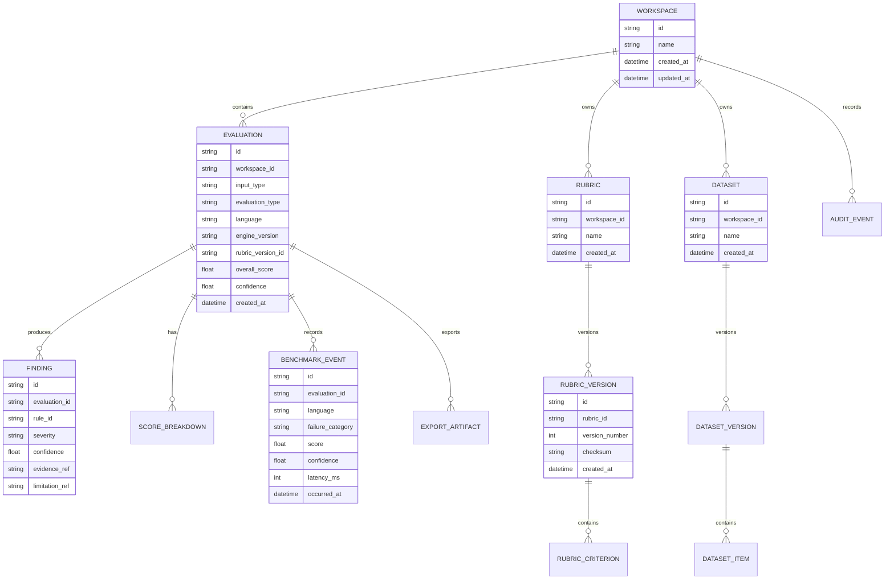

### Storage Responsibilities

SQLite:

- Workspaces.
- Evaluation metadata.
- Findings and score breakdowns.
- Rubrics and rubric versions.
- Dataset records and dataset versions.
- Export artifact metadata.
- Audit events.
- User preferences for local deployment.

DuckDB:

- Benchmark events.
- Analysis latency facts.
- Score and confidence distributions.
- Failure-category aggregates.
- Language and trend slices.
- Report materialization.

## Event Flow

### Single Evaluation Flow

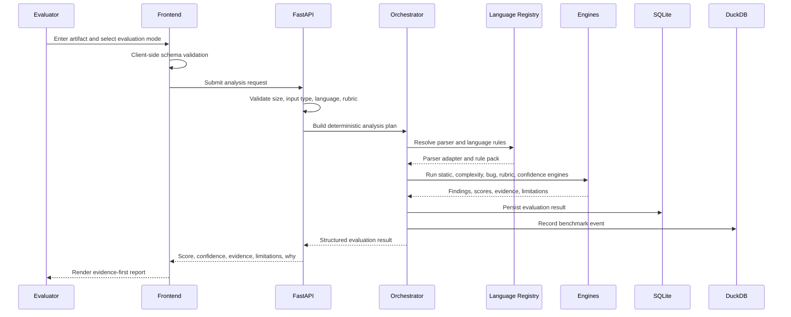

### Rubric Versioning Flow

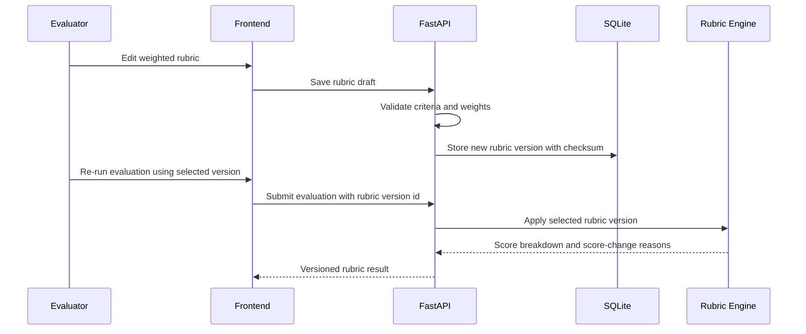

### Export Flow

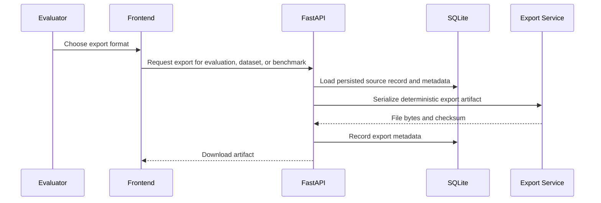

## API Surface Design

Phase 3 will define exact DTOs, schemas, and API contracts. Phase 2 defines resource families only.

- `/health`: liveness.
- `/ready`: readiness including storage checks.
- `/metrics`: Prometheus-compatible metrics.
- `/api/evaluations`: create and read evaluation records.
- `/api/analysis/code-review`: deterministic code quality evaluation.
- `/api/analysis/bug-risk`: static bug-risk evaluation.
- `/api/analysis/complexity`: complexity estimation.
- `/api/analysis/compare`: solution comparison.
- `/api/analysis/ai-response`: prompt-response evaluation.
- `/api/analysis/reasoning`: reasoning evaluation.
- `/api/rubrics`: rubric presets and versions.
- `/api/datasets`: dataset items, versions, and exports.
- `/api/benchmarks`: benchmark aggregates and trends.
- `/api/exports`: JSON, CSV, Parquet-ready, and report exports.

## Security Architecture

### Core Security Rules

- Never execute submitted code.
- Never import submitted code.
- Never shell out with submitted content.
- Never compile submitted content.
- Never call external LLM APIs for evaluation.
- Treat all submitted artifacts as untrusted input.

### Controls

- Pydantic request validation and strict max payload sizes.
- Language allowlist.
- Content-type validation.
- Rate limiting by client identity and deployment mode.
- Security headers from backend and frontend deployment.
- CORS restricted to configured frontend origins.
- Structured audit logging for create, analyze, export, and rubric-version events.
- Dependency scanning in CI.
- Secrets loaded from environment and never logged.
- Error responses do not include stack traces or submitted source.
- Export checksums for auditability.

### Threat Model

- Malicious source text attempting parser crashes: mitigated by size limits, parser timeouts, safe parser APIs, and bounded recursion.
- Prompt injection inside AI response text: treated as inert text, never executed, never sent to a model.
- Data exfiltration through logs: mitigated by redaction and structured logging policies.
- Denial of service through oversized input: mitigated by payload limits and rate limiting.
- Cross-site scripting through rendered evidence: mitigated by escaping and safe rendering, never raw HTML from user input.

## Observability And Monitoring

### Metrics

- Request count by route and status.
- Request latency by route.
- Analysis latency by engine and language.
- Parser failure count by language.
- Finding count by category.
- Confidence distribution.
- Export count by format.
- Rate-limit events.
- Storage query latency.
- Error count by component.

### Logs

Structured JSON logs include:

- Request id.
- Route.
- Engine version.
- Evaluation type.
- Language.
- Latency.
- Status.
- Error category.

Logs do not include submitted source code, prompts, responses, or reasoning bodies by default.

### Health And Profiling

- Liveness reports process availability.
- Readiness verifies SQLite, DuckDB, and required parser registry initialization.
- Profiling is available in development and protected in production.
- Slow-analysis events are recorded for performance regression investigation.

## Deployment Architecture

### Local Development

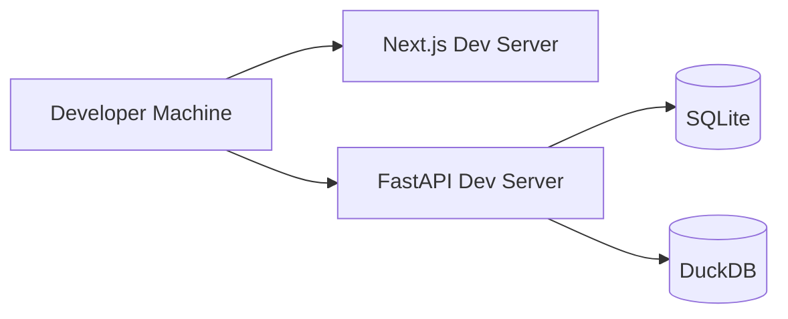

### Production-Like Docker Compose

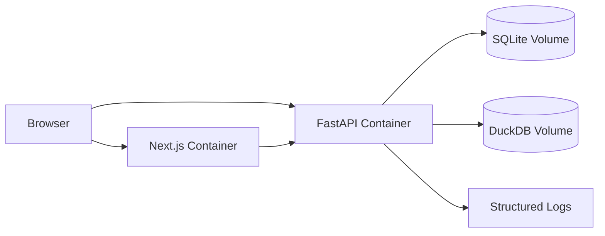

### Hosted Split Deployment

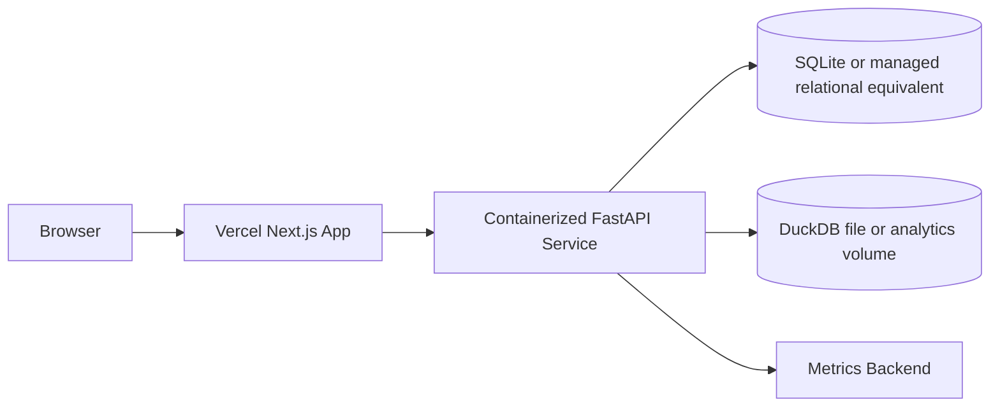

### CI/CD

Pipeline stages:

- Install dependencies.
- Type check frontend and backend.
- Lint frontend and backend.
- Run unit tests.
- Run integration tests.
- Run contract tests.
- Run e2e tests.
- Run visual regression checks.
- Run performance smoke checks.
- Build Docker images.
- Scan dependencies and images.
- Deploy on protected branch.

## Performance Architecture

### Targets

- Cold frontend load under 2 seconds.
- Typical single-artifact analysis under 500 ms.
- Lighthouse 90+.
- Benchmark dashboard aggregate query under 1 second for MVP-scale local data.

### Techniques

- Keep analysis engines synchronous and bounded for MVP.
- Use parser caching only for identical inputs within a request lifecycle.
- Store benchmark facts in DuckDB for efficient aggregates.
- Avoid sending huge evidence payloads by returning source spans and summarized evidence.
- Use React Query caching for history and benchmark reads.
- Lazy-load Monaco and heavy chart views.
- Paginate evaluation history.

## Reliability Architecture

- Engine functions are pure and testable.
- Orchestrator records engine version and rubric version for reproducibility.
- Evaluation records are immutable after creation except for reviewer annotations added in later phases.
- Export artifacts include checksum metadata.
- Parser failures produce explicit limitations rather than fabricated results.
- Backend startup fails if required language registry configuration is invalid.
- Storage migrations run before readiness is reported.

## Accessibility Architecture

- Keyboard-operable analysis workflow.
- Visible focus states.
- WCAG AA contrast targets.
- Screen-reader labels for charts, score summaries, and confidence indicators.
- Evidence regions can be navigated without mouse-only interactions.
- Monaco editor has accessible labels and non-editor fallback rendering for reports.

## SEO And Metadata Architecture

SEO is limited but still production-grade:

- App metadata for product positioning.
- Robots file.
- Sitemap for public documentation routes.
- Structured data for software application pages.
- No indexable user-submitted evaluation content by default.

## Testing Architecture

Testing is mandatory before implementation is marked complete.

- Unit tests for parser adapters, metrics, rules, confidence scoring, rubric scoring, and export serialization.
- Integration tests for API routes, persistence, benchmark recording, and export flows.
- Contract tests for Phase 3 schemas shared between frontend and backend.
- E2E tests for core evaluation workflows.
- Visual tests for dashboard, report, rubric, and export screens.
- Performance tests for representative analysis payloads.
- Regression tests for known false positives and parser edge cases.

Coverage target is at least 90%, with highest priority on analysis engines and contracts.

## Module Ownership Boundaries

### Frontend Owns

- User workflow state.
- Local form validation.
- Presentation of evidence, scores, limitations, and exports.
- Accessibility and responsive layout.
- Client-side caching and navigation.

### Backend Owns

- Authoritative validation.
- Analysis orchestration.
- Persistence.
- Export generation.
- Audit logging.
- Rate limiting.
- Metrics and health.

### Engines Own

- Deterministic scoring logic.
- Rule execution.
- Evidence generation.
- Confidence signals.
- Parser-independent result structures.

### Language Packs Own

- Parser adapters.
- Source span normalization.
- Language-specific rules and idioms.
- Support-tier limitations.

### Storage Layer Owns

- Database schema.
- Migrations.
- Query boundaries.
- Transaction handling.
- Analytical aggregates.

## Architecture Decisions

### ADR-001: Deterministic Analysis Only

Decision: the platform uses ASTs, parser trees, static rules, metrics, and deterministic heuristics. It does not use LLM APIs.

Reason: trust, repeatability, auditability, and product positioning.

### ADR-002: Parse Only, Never Execute

Decision: submitted code is never executed, compiled, imported, or run in a sandbox.

Reason: security, scope control, and clear product identity.

### ADR-003: SQLite Plus DuckDB For MVP

Decision: SQLite stores transactional records; DuckDB stores benchmark facts and aggregate-friendly data.

Reason: local-first deployment, simple operations, strong analytical capability, and enough scale for MVP.

### ADR-004: Engine Layer Is Pure

Decision: analysis engines do not know about HTTP, UI, databases, or exports.

Reason: testability, reproducibility, and easier plugin expansion.

### ADR-005: Evidence-First Result Assembly

Decision: result objects are assembled around findings, evidence, limitations, and confidence before final score presentation.

Reason: product principle is trust over intelligence.

## Open Questions For Phase 3

- Exact score scale and rounding policy.
- Exact confidence scale and calibration language.
- Version checksum strategy for rubrics and engines.
- Maximum payload sizes per input type.
- Source span representation across languages.
- Contract shape for evidence, limitations, findings, exports, and benchmark facts.
- Whether MVP persists raw submitted artifacts or stores only checksummed content plus derived evidence.

## Approval Gate

Phase 2 is complete when this architecture is approved. After approval, Phase 3 will create entities, DTOs, schemas, and API contracts and freeze interfaces before foundation code begins.
